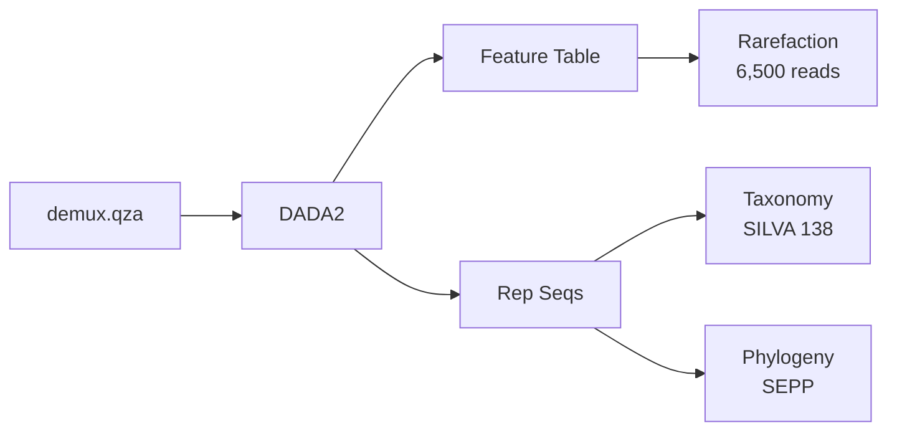
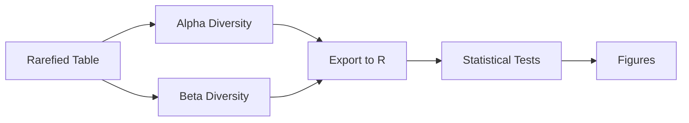

# IF-P vs CR Microbiome Reproduction Study

[](https://qiime2.org/)
[](https://www.r-project.org/)
[](https://en.wikipedia.org/wiki/Gut_microbiota)
[](https://cran.r-project.org/package=randomForest)
[](LICENSE)

## 📋 Overview

This repository contains the complete bioinformatics pipeline and analysis code for reproducing the gut microbiome analysis from:

> **Mohr AE, et al. (2024).** "Gut microbiome remodeling and metabolomic profile improves in response to protein pacing with intermittent fasting versus continuous caloric restriction." *Nature Communications*, 15, 4155.

### Study Summary

The original study compared two calorie-matched dietary interventions over 8 weeks in 41 participants with overweight/obesity:
- **IF-P (Intermittent Fasting with Protein Pacing):** 5:2 fasting pattern with 4-5 protein-rich meals/day
- **CR (Continuous Caloric Restriction):** Heart-healthy diet with 25% caloric deficit

**Key Finding:** IF-P produced distinct gut microbiome signatures independent of caloric restriction, with enrichment of beneficial bacteria like *Christensenellaceae*.

---

## 🔗 Links

| Resource | Link |
|----------|------|
| **Original Paper** | [Nature Communications](https://doi.org/10.1038/s41467-024-48355-5) |
| **Raw Data (SRA)** | [PRJNA847971](https://www.ncbi.nlm.nih.gov/bioproject/PRJNA847971) |
| **Original Code** | [GitHub](https://github.com/Alex-E-Mohr/GM-Remodeling-IF-ProteinPacing-vs-CaloricRestriction) |

---

## 📁 Repository Structure

```
IF-P-vs-CR-Microbiome-Reproduction/
│
├── scripts/
│   ├── bash/                           # QIIME2 pipeline scripts
│   │   ├── download.sh                 # Download data from ENA
│   │   ├── fastqc.sh                   # Run FastQC quality control
│   │   ├── multiqc.sh                  # Aggregate QC reports
│   │   ├── qiime2_dada2.sh             # DADA2 denoising
│   │   ├── qiime2_taxo.sh              # Taxonomy classification (SILVA 138)
│   │   ├── qiime2_train_silva_138_v4.sh # Train V4-specific classifier
│   │   ├── qiime2_sepp.sh              # Phylogenetic tree (SEPP)
│   │   ├── qiime2_tree.sh              # Alternative tree building
│   │   ├── qiime2_alpha.sh             # Alpha diversity analysis
│   │   └── taxa_collapse.sh            # Collapse taxa at different levels
│   │
│   └── R/                              # R analysis scripts
│        ├── create_phyloseq.R          # Build phyloseq object from QIIME2 exports
│        ├── figure_1e_alpha.R          # Alpha diversity (Observed ASVs)
│        ├── figure_1g_beta.R           # Beta diversity (Bray-Curtis from baseline)
│        ├── beneficial_bacteria.R      # Christensenellaceae/Rikenellaceae/Ruminococcaceae
│        ├── beta_trajectory.R          # PCoA with trajectories
│        └── machine_learning.R         # Random Forest
│
├── metadata/
│   ├── metadata.tsv                    # Sample metadata (41 participants × 3 timepoints)
│   └── SRR_Acc_List.txt                # SRA accession numbers
│
├── results/
│   ├── qiime2/                         # QIIME2 pipeline outputs
│   │   ├── alpha-diversity/            # Alpha diversity metrics
│   │   │   ├── evenness.tsv
│   │   │   ├── faith_pd.tsv
│   │   │   ├── observed_features.tsv
│   │   │   └── shannon.tsv
│   │   ├── beta-diversity/             # Beta diversity metrics
│   │   │   ├── bray_curtis_distance.tsv
│   │   │   ├── jaccard_distance.tsv
│   │   │   ├── pcoa_ordination.txt
│   │   │   ├── unweighted_unifrac_distance.tsv
│   │   │   └── weighted_unifrac_distance.tsv
│   │   ├── qc/                         # Quality control reports
│   │   │   ├── demultiplex-summary-forward.png
│   │   │   ├── demultiplex-summary-reverse.png
│   │   │   ├── forward-seven-number-summaries.tsv
│   │   │   ├── per-sample-fastq-counts.tsv
│   │   │   └── reverse-seven-number-summaries.tsv
│   │   ├── tables/                     # Feature tables
│   │   │   ├── asv-table.tsv
│   │   │   ├── family-table.tsv
│   │   │   ├── feature-table_exported-for-R.biom
│   │   │   ├── feature-table_family.biom
│   │   │   ├── feature-table_full.biom
│   │   │   ├── feature-table_rarefied6500.biom
│   │   │   └── feature-table-rarefied6500.tsv
│   │   ├── qiime2-sample-groups.tsv    # Sample groupings
│   │   ├── rep-seqs.fasta              # Representative sequences
│   │   ├── taxonomy.tsv                # Taxonomy classifications
│   │   └── tree.nwk                    # Phylogenetic tree (Newick format)
│   │
│   └── figures/                        # Generated figures
│       ├── Figure_1e_alpha_diversity.png
│       ├── Figure_1g_beta_diversity.png
│       ├── Beta_Trajectory_PCoA.png
│       ├── BeneficialBacteria_Boxplot.png
│       └── RF_Top10Features.png
│
├── .gitignore                          # Git ignore rules
└── README.md                           # Project documentation
```

---

## 🔬 Pipeline Overview

### Stage 1: Data Preparation


**Steps:**
1. Download 120 paired-end samples (240 FASTQ files) from ENA
2. Run quality control with FastQC
3. Aggregate reports with MultiQC
4. Import into QIIME2 using paired-end manifest

### Stage 2: QIIME2 Processing



**Steps:**
1. **DADA2 Denoising:** Quality filter, error correct, merge pairs, remove chimeras
   - Trim: 20bp (primer removal)
   - Truncate: 240bp (quality threshold)
2. **Taxonomy Classification:** SILVA 138 database with V4-trained classifier
3. **Phylogenetic Tree:** SEPP fragment insertion
4. **Rarefaction:** Normalise to 6,500 reads/sample

### Stage 3: Diversity & Export



**Steps:**
1. Calculate alpha diversity (Observed ASVs, Shannon, Faith's PD)
2. Calculate beta diversity (Bray-Curtis, UniFrac)
3. Export to R: ASV table, taxonomy, metadata
4. Statistical analysis and figure generation

---

## 💻 Requirements

### HPC Environment (BlueBear)

| Software | Version | Module |
|----------|---------|--------|
| QIIME2 | 2025.4 | `module load QIIME2/2025.4` |
| FastQC | 0.11.9+ | `module load FastQC` |
| MultiQC | 1.12+ | `module load MultiQC` |

### R Environment

```r
# Required packages
install.packages(c("tidyverse", "vegan", "ggplot2", "RColorBrewer"))

# Bioconductor packages
BiocManager::install(c("phyloseq", "DESeq2"))

# Optional for machine learning
install.packages(c("randomForest", "caret"))
```

---

## 🚀 Usage

### Running the QIIME2 Pipeline

# Load QIIME2 module
module purge
module load bear-apps/2023a
module load QIIME2/2025.4

# Run pipeline scripts in order
sbatch scripts/bash/download.sh          # Day 1: Download data
sbatch scripts/bash/fastqc.sh            # Day 1: Quality control
sbatch scripts/bash/qiime2_dada2.sh      # Days 2-3: DADA2 (48 hours)
sbatch scripts/bash/qiime2_taxo.sh       # Day 4: Taxonomy
sbatch scripts/bash/qiime2_sepp.sh       # Day 4: Phylogenetic tree
sbatch scripts/bash/qiime2_alpha.sh      # Day 5: Diversity metrics
sbatch scripts/bash/export_for_R.sh      # Day 5: Export for R
```

### R Analysis

```r
# Step 1: Create phyloseq object and input files (RUN FIRST)
# Reads QIIME2 exports and creates phyloseq_object.rds
source("scripts/R/create_phyloseq.R")

# Step 2: Figure 1e - Alpha Diversity (Observed ASVs)
# Requires: metadata_merged_qiime_FINAL.tsv, alpha-observed.tsv
source("scripts/R/figure_1e_alpha.R")

# Step 3: Figure 1g - Beta Diversity (Bray-Curtis from baseline)
# Requires: distance-matrix.tsv, metadata_merged.tsv
source("scripts/R/figure_1g_beta.R")

# Step 4: Beneficial Bacteria Analysis
# Requires: phyloseq_object.rds
source("scripts/R/beneficial_bacteria.R")

# Step 5: Beta Diversity Trajectories
# Requires: phyloseq_object.rds
source("scripts/R/beta_trajectory.R")

# Step 6: Machine Learning (Random Forest)
# Requires: phyloseq_object.rds
source("scripts/R/machine_learning.R")
```

### Generated Figures

**Reproduced from Paper:**
- `Figure_1e_alpha_diversity.pdf/png` - Alpha diversity (Observed ASVs) over time
- `Figure_1g_beta_diversity.pdf/png` - Beta diversity (Bray-Curtis from baseline)

**Original Analyses (Supporting Same Conclusions):**
- `Beta_Trajectory_PCoA.pdf/png` - PCoA with individual trajectories (WK0→WK4→WK8)
- `BeneficialBacteria_Boxplot.pdf/png` - Christensenellaceae/Rikenellaceae/Ruminococcaceae with p-values
- `RF_Top10Features.pdf/png` - Random Forest feature importance
---

## 📊 Key Results

| Metric | Value |
|--------|-------|
| **Samples processed** | 117 (after quality filtering) |
| **Read retention** | ~60-70% after DADA2 |
| **Rarefaction depth** | 6,500 reads/sample |
| **ASVs identified** | ~X,XXX unique sequences |

### Key Findings Reproduced:
- ✅ Beta diversity separation between IF-P and CR groups
- ✅ *Christensenellaceae* enrichment in IF-P
- ✅ Machine learning classification accuracy: ~79.5%

---

## 👥 Team Contributions

**Collaborative Project by:** Nubla Latheef, Rayane Baroudi, Farah Malwan

All team members contributed equally to:
- QIIME2 pipeline development and execution
- R statistical analysis and visualisation
- Machine learning validation
- Documentation and presentation

---

## 📚 References

1. Mohr AE, et al. (2024). Gut microbiome remodeling and metabolomic profile improves in response to protein pacing with intermittent fasting versus continuous caloric restriction. *Nature Communications*, 15, 4155.

2. Bolyen E, et al. (2019). Reproducible, interactive, scalable and extensible microbiome data science using QIIME 2. *Nature Biotechnology*, 37, 852-857.

3. Callahan BJ, et al. (2016). DADA2: High-resolution sample inference from Illumina amplicon data. *Nature Methods*, 13, 581-583.

4. Quast C, et al. (2013). The SILVA ribosomal RNA gene database project. *Nucleic Acids Research*, 41, D590-D596.

---

## 🎓 Acknowledgments

- **Original Study Authors:** Mohr AE and colleagues
- **Institution:** University of Birmingham, Dubai
- **Course:** MSc Bioinformatics
- **Computing Resources:** BlueBear HPC, University of Birmingham

---

## 📄 License

This project is for educational purposes as part of coursework at the University of Birmingham. The original data and methodology belong to Mohr et al. (2024).

---

## 📧 Contact

For questions about this reproduction study:
- fnl759@student.bham.ac.uk

For questions about the original study:
- See original publication contact information
